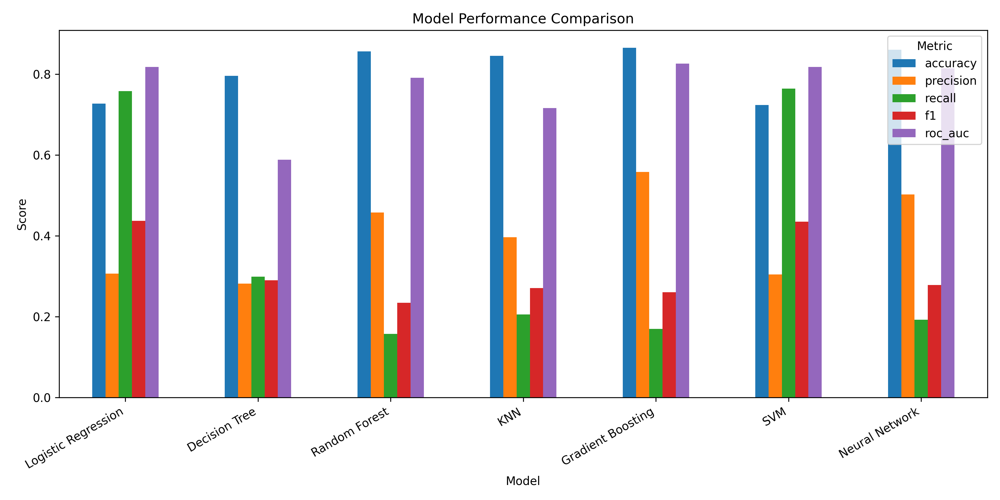
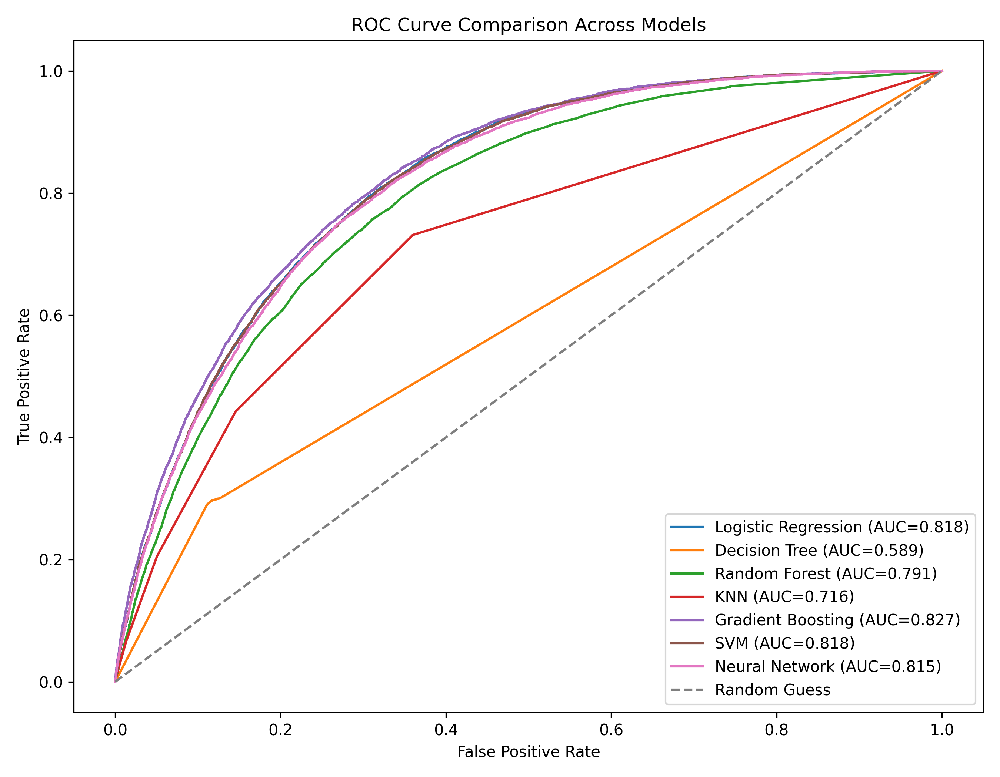
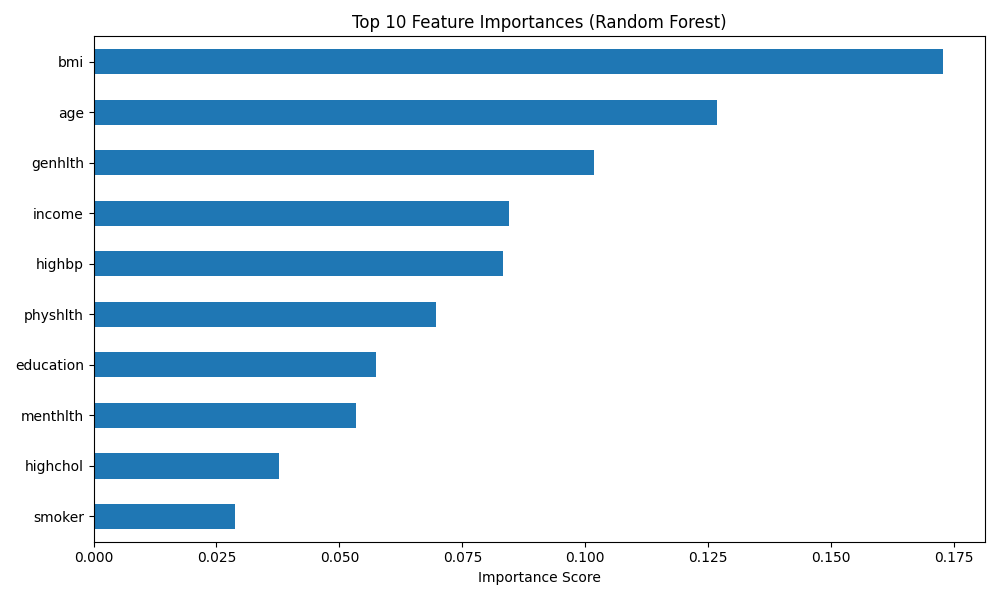

# CS210 Diabetes Prediction Project

## Course Information  

Rutgers University – New Brunswick  
CS210 Data Management For Data Science
Spring 2026  

## Team Members  
 
- Hongyu Shi (hs1208)
- Qiwei Chen (qc145)
- Puxiang Wang(pw383)

## Overview

This project analyzes diabetes risk factors using the BRFSS 2015 Diabetes Health Indicators Dataset. We built a full data pipeline that includes PostgreSQL database design, ETL processing, SQL analytics, and machine learning models to predict diabetes status.

The project demonstrates how structured health survey data can be transformed into actionable insights through data engineering and predictive analytics.

---

## Objectives

- Build a relational PostgreSQL database from raw survey data
- Normalize the dataset into multiple linked tables
- Perform SQL-based health analytics
- Train machine learning models to predict diabetes
- Identify key risk factors associated with diabetes

---

## Dataset

**Source:** Kaggle - Diabetes Health Indicators Dataset

**Link:**  
https://www.kaggle.com/datasets/alexteboul/diabetes-health-indicators-dataset

Records: 253,680 respondents

Target Variable:

- `diabetes_binary`
    - 0 = No diabetes
    - 1 = Diabetes

Features include:

- BMI
- Age
- Income
- High Blood Pressure
- High Cholesterol
- Smoking
- Physical Activity
- General Health
- Mental Health
- Education

---

## Tech Stack

- Python
- PostgreSQL
- Pandas
- SQLAlchemy
- Scikit-learn
- Matplotlib

---

## Database Design

The raw dataset was normalized into four relational tables:

- `respondents`
- `demographics`
- `health_indicators`
- `diabetes_labels`

---

## ETL Pipeline

1. Import raw CSV into staging table
2. Clean and validate records
3. Split data into normalized tables
4. Load into PostgreSQL relational schema

---

## SQL Analysis

Example findings:

### Diabetes Prevalence

- 13.94% diabetic
- 86.06% non-diabetic

### Average BMI

- Non-diabetic: 27.81
- Diabetic: 31.94

### Age Trend

Diabetes prevalence increases significantly with age.

---

## Machine Learning Models

We trained and compared multiple models:

- Logistic Regression  
- Decision Tree  
- Random Forest  
- K-Nearest Neighbors (KNN)  
- Gradient Boosting  
- Support Vector Machine (SVM)  
- Neural Network (MLP)
  
---

## Model Performance

| Model | Accuracy | Precision | Recall | F1 | ROC-AUC |
|------|--------|----------|--------|----|--------|
| Logistic Regression | 0.728 | 0.307 | 0.759 | 0.437 | 0.818 |
| Decision Tree | 0.796 | 0.282 | 0.299 | 0.290 | 0.589 |
| Random Forest | 0.857 | 0.458 | 0.158 | 0.235 | 0.791 |
| KNN | 0.846 | 0.397 | 0.206 | 0.271 | 0.716 |
| Gradient Boosting | 0.857 | 0.559 | 0.170 | 0.261 | 0.827 |
| SVM | 0.724 | 0.305 | 0.765 | 0.436 | 0.818 |
| Neural Network | 0.861 | 0.503 | 0.193 | 0.279 | 0.815 |

---

## Model Comparison Visualization

### Model Performance Comparison

This figure compares all trained models across accuracy, precision, recall, F1-score, and ROC-AUC. It shows that no single model dominates every metric. 
Logistic Regression and SVM achieve the strongest recall, which is especially valuable in a healthcare setting because missing diabetes cases is costly. 
Gradient Boosting performs well overall and provides one of the strongest ROC-AUC values, while Random Forest and Neural Network achieve high accuracy but 
lower recall, meaning they miss more positive cases. This comparison reflects our project goal of evaluating multiple classification approaches rather than focusing on only one model.

---

## ROC Curve Comparison

The ROC curve evaluates model performance across different thresholds.

This ROC curve plot compares the discrimination ability of all models across decision thresholds. Gradient Boosting achieves the highest ROC-AUC at 0.827, while Logistic Regression and SVM both perform strongly at 0.818. These curves show that the best-performing models can separate diabetic and non-diabetic respondents much better than random guessing. The figure is important for our project because ROC-AUC provides a threshold-independent measure of predictive quality and helps us compare models more fairly on an imbalanced dataset.

---

## Exploratory Data Analysis

### Feature Importance

This figure presents the top ten most important features from the Random Forest model. BMI is the most influential predictor, followed by age, general health, income, and high blood pressure. These results are especially valuable for our project because they connect model performance back to interpretable public health factors. Rather than treating the model as a black box, this plot helps explain which variables are driving diabetes risk classification and why the model makes its predictions.

### Additional Visualizations

- BMI vs Diabetes  
- Age vs Diabetes Rate  
- Correlation Heatmap  
- Class Distribution  

---

## Key Predictors of Diabetes

Feature importance from Random Forest:

1. BMI
2. Age
3. General Health
4. Income
5. High Blood Pressure

---

## Key Insights

- Logistic Regression and SVM achieve **high recall**  
  → Good for detecting diabetes cases  

- Random Forest has high accuracy but **low recall**  
  → Misses many positive cases  

- Gradient Boosting provides balanced performance  

- Neural Network shows moderate performance but can be improved  

In healthcare prediction, **recall is more important than accuracy**, because missing a diabetes case is costly.

---

